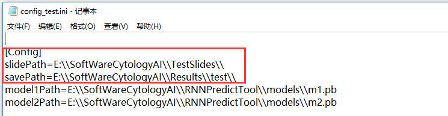
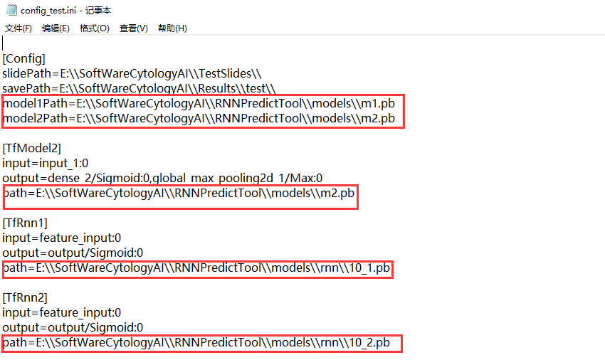
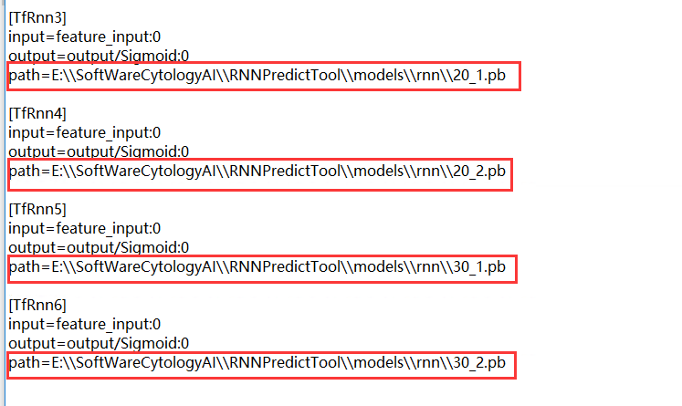
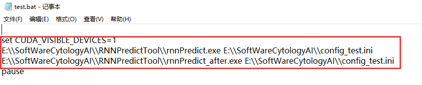
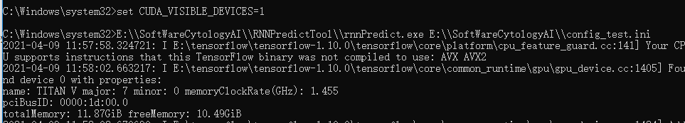
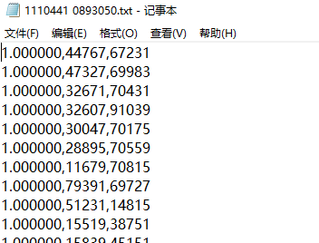
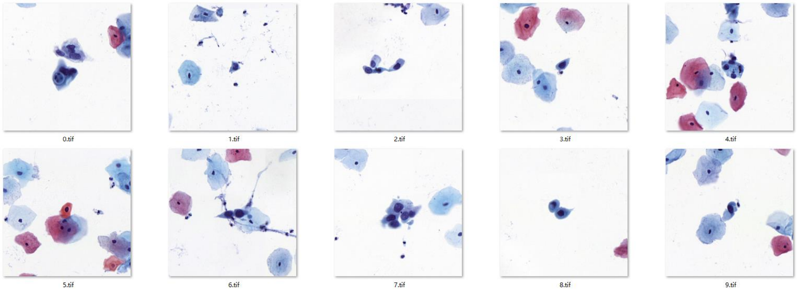
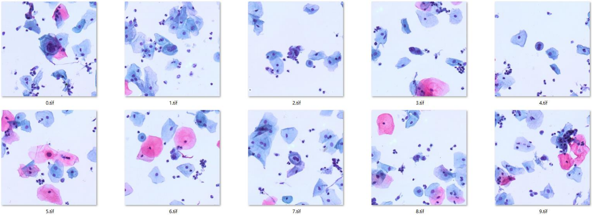
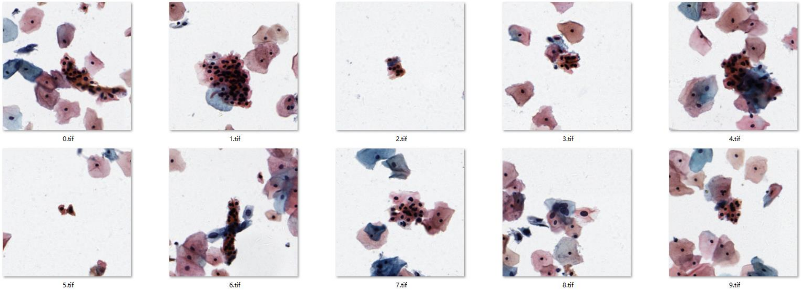

# User Manual

## Computer requirements
**System:** Win10\
**GPU:** Nvidia 1080Ti or better (at least 10G memory), with Nvidia corresponding driver\
**CUDA:** CUDA 10.0\
**CPU:** Intel i7 or better\
**System Memory:** 16G or better

---
## Supported WSI formats
The software supports the WSI formats supported by the opensource OpenSlide library, including `x.svs`, `x.mrxs`, `x.tif`, etc.\
WSI resolution: 20× or 40× (0.1 – 0.6 um/pixel, 0.1 – 0.4 um/pixel is better)

---
## Functions of the software
Recommend the top 10 lesion cells and predict the positive probability of WSIs.

---
## Steps of using the software
**Step1:** Edit the `slidePath` and `savepath` of the `config.ini` file according to your paths as the format of the example\
**Note:** please use absolute path\

**Step2:** Edit the paths of TfModel1, TfModel2 and TfRnn1-TfRnn6 as the format of the example
**Note:** please use absolute path\
\

**Step3:** Edit the paths of the `rnnPredict.exe` and the `config.int` in the `test.bat` file\

**Step4:** Run the `test.bat` file\

**Step5:** View the results\
For each slide, the results include the cropped image patches of recommended top 10 lesion cells and the predicted positive probability of the slide in `xx.rnnscore`.\
In `xx.txt` below, the positive probability, (x, y) position of recommended cells are provided. Notably, the (x, y) position is relative to the rectangle bounding the non-empty region of the slide, if available by querying slide properties by `OpenSlide`.\

 ---
## Example
**Slide 1:** 1110441 0893050.mrxs\
Predicted score of slide：1.00\
Recommended lesion cells: the recommended lesion cells refer to the cells in center region of the patch (about 243 um2)\

**Slide2**: 1179536.svs\
Predicted score of slide：1.00\
Recommended lesion cells:\

**Slide3:** 0067309 1009017.mrxs\
Predicted score of slide：0.00\
Recommended lesion cells:\

**Slide4:** 1159929.svs\
Predicted score of slide：0.009\
Recommended lesion cells:\

